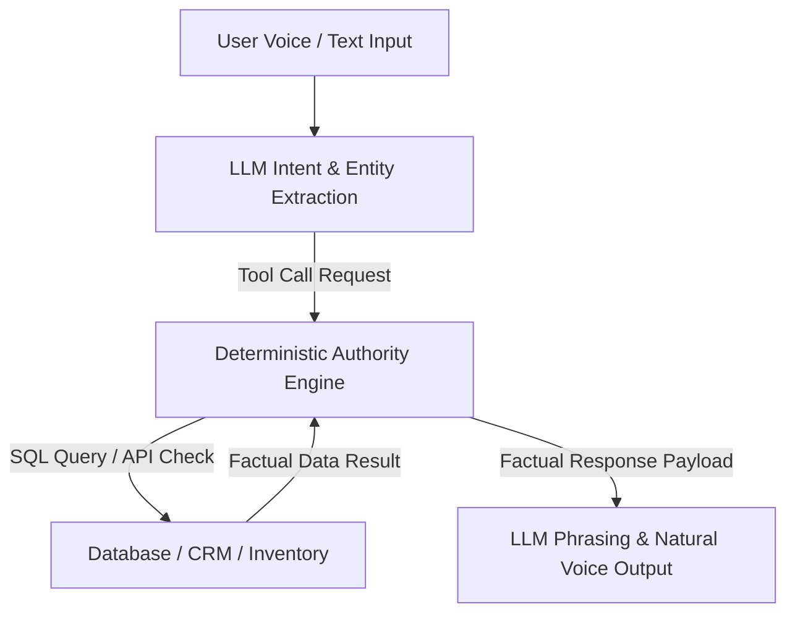

# 🛡️ AI Voice & Agent Security (Authority Isolation) Skill

This skill governs the anti-hallucination architectural rule: **"AI controls language. Application code controls authority."**

---

## 🛠️ Architecture Principles



### 1. Separation of Responsibilities
- **LLM / Voice Agent (Language Layer):** Interprets user intent, formats polite conversational phrasing, asks clarifying questions.
- **Backend Code & SQL (Authority Layer):** Holds 100% authority over inventory availability, pricing, appointment slots, and database mutations.

### 2. Hallucination Prevention Rules
- The LLM must NEVER invent stock numbers, prices, or calendar availability.
- All factual queries must trigger a deterministic tool call (e.g. `check_inventory({ vin, model })`).
- If the database returns `0 results`, the LLM is constrained to state "Item unavailable" and suggest verified alternatives.

---

## 💻 Sample Tool Calling Pattern (TypeScript)

```typescript
export async function handleAgentToolCall(toolName: string, args: Record<string, any>, tenantId: string) {
  // Deterministic execution in application code - zero AI hallucination
  if (toolName === "check_inventory") {
    const result = await db.query(
      `SELECT year, make, model, price, stock_no FROM inventory WHERE tenant_id = $1 AND model = $2 AND status = 'AVAILABLE'`,
      [tenantId, args.model]
    );
    return JSON.stringify(result.rows);
  }
  throw new Error(`Unauthorized tool call: ${toolName}`);
}
```
