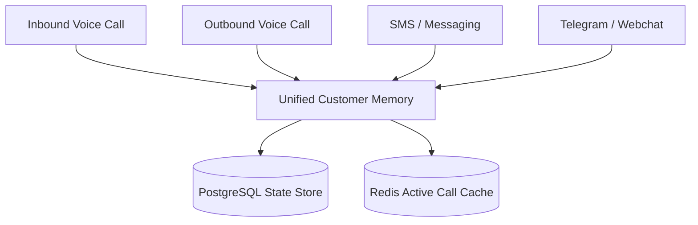

# 🧠 Cross-Session Omnichannel Memory Skill

This skill defines the unified customer memory architecture sharing conversational context seamlessly across Voice calls, SMS messages, Telegram, and Webchat interfaces.

---

## 🛠️ Unified State Architecture



---

## 💡 Customer Memory Schema Standard

Every lead or customer record maintains a centralized `customer_memory` JSON payload:

```json
{
  "tenant_id": "dealer_102",
  "lead_id": "lead_99812",
  "customer_info": {
    "name": "Alex Smith",
    "phone": "+15550192834"
  },
  "context": {
    "vehicle_of_interest": "2024 Ford F-150",
    "budget_max": 45000,
    "trade_in_mentioned": true,
    "objections": ["Financing rate concern"],
    "last_channel": "SMS",
    "last_summary": "Customer discussed trade-in options over SMS and asked for evening appointment."
  },
  "appointment": {
    "status": "PROPOSED",
    "requested_time": "2026-08-15T18:00:00Z"
  }
}
```
