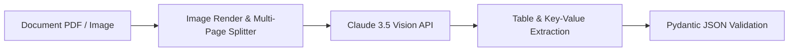

# 📄 Document OCR & Vision Parser Skill

This skill defines the architectural pattern for parsing invoices, receipts, PDFs, and scanned documents using Multimodal Vision LLMs (Claude 3.5 Sonnet Vision) combined with structured JSON extraction.

---

## 🛠️ Architecture Blueprint



### 1. Document Preparation
- Convert PDF pages into high-DPI PNG/JPEG images (200-300 DPI).
- Compress image files to under 5MB per page for fast API transfer.

### 2. Vision Extraction Prompting
- Pass base64 image data directly into Claude 3.5 Sonnet / Vision model.
- Instruct model to preserve exact table structures, numbers, dates, line items, and totals.

### 3. Key Target Fields (Invoice Example)
- `vendor_name`: String
- `invoice_date`: YYYY-MM-DD
- `total_amount`: Float
- `tax_amount`: Float
- `line_items`: Array of `{ description, quantity, unit_price, total }`

---

## 💡 Example Prompt Blueprint

```text
You are an expert document vision parser.
Analyze this invoice image and extract all key data into a valid JSON object matching this schema:

{
  "vendor_name": "Company Name",
  "invoice_number": "INV-12345",
  "invoice_date": "2026-08-14",
  "total_due": 1250.00,
  "line_items": [
    { "description": "Software Subscription", "qty": 1, "price": 1250.00 }
  ]
}

Return STRICTLY JSON. Do not include markdown code blocks or conversational text.
```
