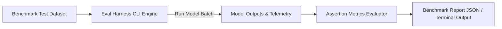

# 🎯 Formal Eval Harness & Benchmarking Skill

This skill defines the implementation of dedicated Evaluation Harness CLI tooling (`npm run eval` / `python eval.py`) for running automated benchmarks on AI agents and prompt updates.

---

## 🛠️ Eval Harness Architecture



### 1. Benchmark Dataset Standard (`eval_dataset.json`)
Maintain a version-controlled benchmark dataset containing test inputs, expected invariants, and source citation keys.

### 2. Metric Scoring Assertions
- **Latency Assertions:** `latency_ms <= 2000`
- **Factual Match Score:** `similarity_score >= 0.85`
- **Hallucination Rate:** `hallucination_count === 0`
- **Cost Budget Assertions:** `cost_per_query_usd <= 0.005`

---

## 💻 Sample Eval Harness Command

```bash
npm run eval -- --dataset=eval_dataset.json --threshold=0.9
```
