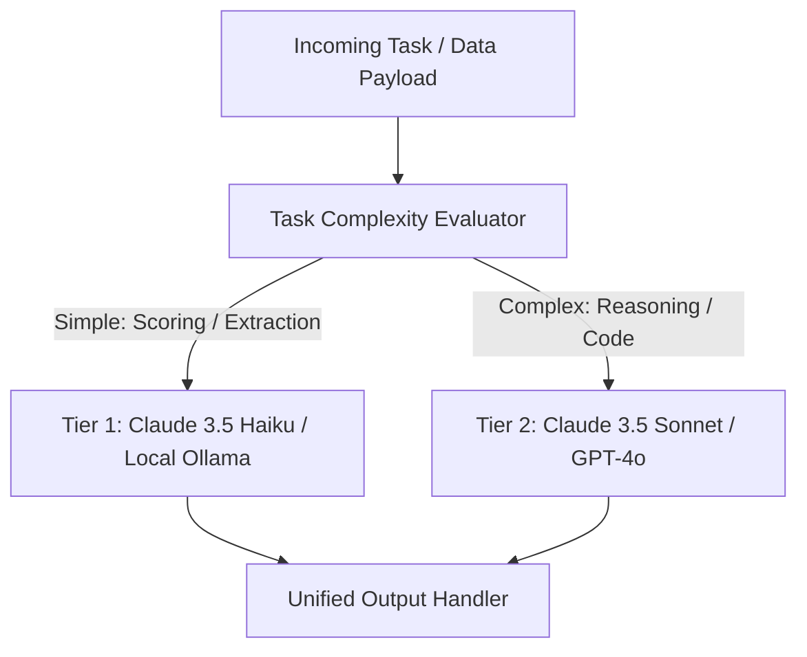

# 🔀 Hybrid LLM Routing Skill

This skill defines the multi-model routing pattern for AI Agent architectures. Simple tasks (text classification, entity extraction, relevance scoring) are dispatched to ultra-fast, cheap models, while complex tasks (proposal drafting, code generation, reasoning) are routed to frontier models.

---

## 🛠️ Architecture Overview



---

## 💡 Model Routing Tiers

1. **Tier 1 (Fast & Low Cost):**
   - **Models:** `claude-3-5-haiku`, `gpt-4o-mini`, `ollama/llama3`
   - **Tasks:** Pre-qualification scoring, regex/keyword matching, tech stack tag extraction, simple JSON structuring.
   - **Cost Savings:** ~80-90% cheaper than Tier 2.

2. **Tier 2 (Frontier Reasoning):**
   - **Models:** `claude-3-5-sonnet`, `gpt-4o`
   - **Tasks:** Tailored proposal generation, technical architecture design, multi-file code editing, complex RAG synthesis.

---

## 💻 Implementation Pattern (Python / TS)

```typescript
export async function routeLLMTask(taskType: "classify" | "generate", prompt: string) {
  const model = taskType === "classify" ? "claude-3-5-haiku-20241022" : "claude-3-5-sonnet-20241022";
  
  return await callLLMProvider({
    model,
    messages: [{ role: "user", content: prompt }],
    temperature: taskType === "classify" ? 0.1 : 0.3
  });
}
```
