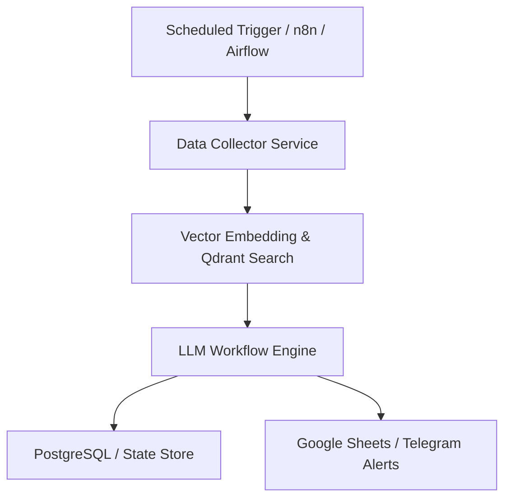

# ⚙️ Hybrid n8n & Vector DB Pipeline Skill

This skill defines the enterprise hybrid architecture combining low-code/no-code orchestration (n8n / Airflow) with high-performance Vector Databases (Qdrant / pgvector) and automated reporting.

---

## 🛠️ Architecture Overview

---

## 💡 Architectural Layer Responsibilities

1. **Orchestration Layer (n8n / Airflow / Python Cron):**
   - Triggers workflows on scheduled cron intervals or webhook events.
   - Manages task queues, execution logs, and workflow dependencies.

2. **Vector DB Layer (Qdrant / pgvector):**
   - Stores dense embeddings (OpenAI `text-embedding-3-small` / Cohere).
   - Performs hybrid keyword + semantic similarity retrieval ($k$-NN search).

3. **Analytics & Dashboard Layer (Google Sheets / Supabase):**
   - Automatically syncs enriched outputs into tabular format for client visibility.
   - Updates real-time KPI metrics and statistical tabs.
