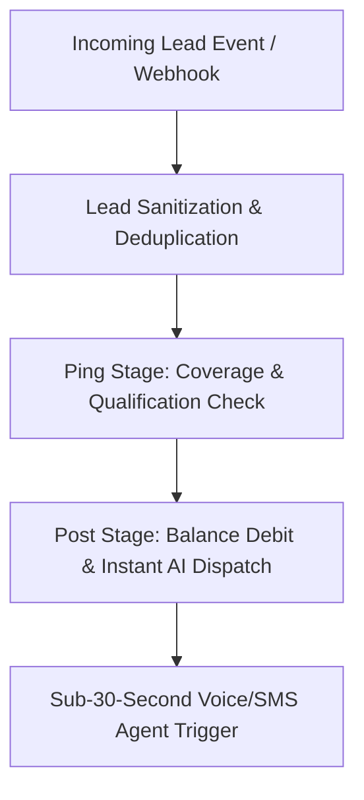

# ⚡ Lead Ping-Post & Speed-to-Lead Engine Skill

This skill governs high-velocity lead ingestion, instant scoring, ping-post auction routing, and sub-30-second AI outreach dispatch.

---

## 🛠️ Architecture Blueprint

### Key Performance Rules
1. **Speed-to-Lead Threshold:** Trigger automated AI voice/SMS within **< 30 seconds** of lead creation.
2. **Ping-Post Auction Logic:** Validate zip code coverage, contractor/dealership active balance, and service area rules before posting.
3. **Exclusive Slot Reservation:** Guarantee lead isolation so no duplicate agent calls occur.
