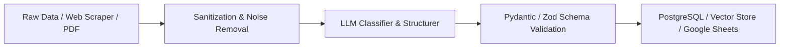

# 🧹 LLM Data Enrichment & Auto-Cleaning Skill

This skill provides patterns for building end-to-end data ingestion pipelines that take raw, noisy unstructured text or scraped data, clean it, and enrich it via LLMs with strict schema validation.

---

## 🛠️ Architecture & Workflow



### 1. Pre-Processing & Sanitization
- Strip HTML tags, redundant whitespace, control characters, and duplicated boilerplate.
- Extract metadata (timestamps, URLs, source identifiers).

### 2. LLM Extraction & Classification Prompting
- Enforce strict JSON output mode (`response_format: { type: "json_object" }`).
- Extract key entities (skills, budget ranges, sentiment, risk score, tags).

### 3. Schema Validation & Failover Handling
- Validate output with Pydantic (Python) or Zod (TypeScript).
- On schema failure, trigger automatic retry with repair prompt or fallback to heuristic parser.

---

## 💡 Example Implementation (Python / Pydantic)

```python
from pydantic import BaseModel, Field
from typing import List, Optional

class EnrichedDataRecord(BaseModel):
    category: str = Field(description="Primary category of the record")
    tech_stack: List[str] = Field(default_factory=list, description="Extracted technologies")
    budget_max: Optional[float] = Field(default=None, description="Max extracted budget")
    risk_score: int = Field(ge=0, le=100, description="Risk score 0-100")
    summary: str = Field(description="Clean 1-sentence summary")

def enrich_record(raw_text: str) -> EnrichedDataRecord:
    # 1. Clean input
    cleaned_text = " ".join(raw_text.split())
    
    # 2. Call LLM with JSON schema enforcement
    # ... LLM API call ...
    
    # 3. Return validated object
    return EnrichedDataRecord.model_validate_json(llm_output_str)
```
