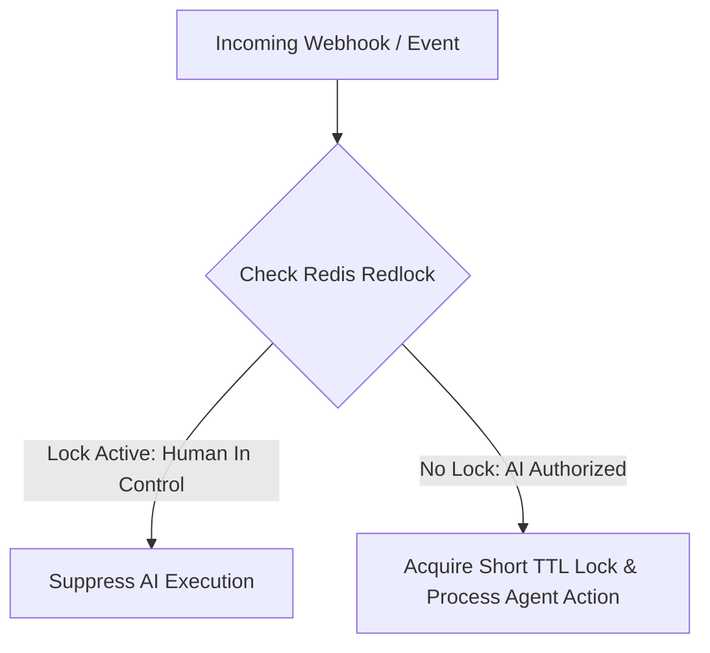

# 🔒 Stateful Enterprise Orchestration & Lock Skill

This skill governs race condition prevention and human takeover locking across distributed AI voice, SMS, and web agents.

---

## 🛠️ Human Takeover & Race Condition Rules

### 1. Human Takeover Lock
When a human sales agent opens a conversation inbox or manually sends a message:
- Set a Redis key: `SET takeover:lead_123 "HUMAN_OPERATOR" EX 1800` (30 minute TTL).
- While `takeover:lead_123` exists, all automated AI voice/SMS sequences are immediately suppressed.

### 2. Queue-Level De-duplication (BullMQ)
- Use BullMQ jobs with deterministic `jobId`: `jobId = MD5(tenant_id + lead_id + action_type + rounded_timestamp)`.
- If a duplicate webhook arrives within the deduplication window, BullMQ rejects the job automatically.
