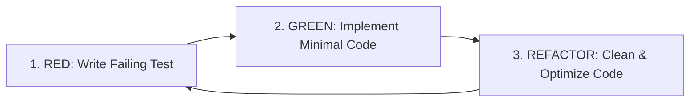

# 🧪 Test-Driven Development (TDD) Skill

This skill governs Test-Driven Development across all code modifications, refactoring, and new feature implementations.

---

## 🛠️ The 3-Phase TDD Loop



### Phase 1: RED (Write Failing Tests First)
- Write tests that capture the expected feature requirements or reproduce reported bugs.
- Run tests (`node --test` or `npm test`) to verify that the test fails for the right reason.

### Phase 2: GREEN (Implement Minimal Code to Pass)
- Write the minimum amount of production code required to make the test pass.
- Re-run tests to confirm all assertions pass (`pass 100%`).

### Phase 3: REFACTOR (Optimize & Clean Code)
- Clean up duplicate code, optimize performance, and improve variable naming.
- Ensure all tests continue to pass with zero regressions.

---

## 💻 Test Suite Pattern (`node --test`)

```javascript
const assert = require("assert");
const test = require("node:test");

test("Feature: enforces strict schema validation", () => {
  const result = validatePayload({ name: "Test" });
  assert.strictEqual(result.isValid, true);
});
```
