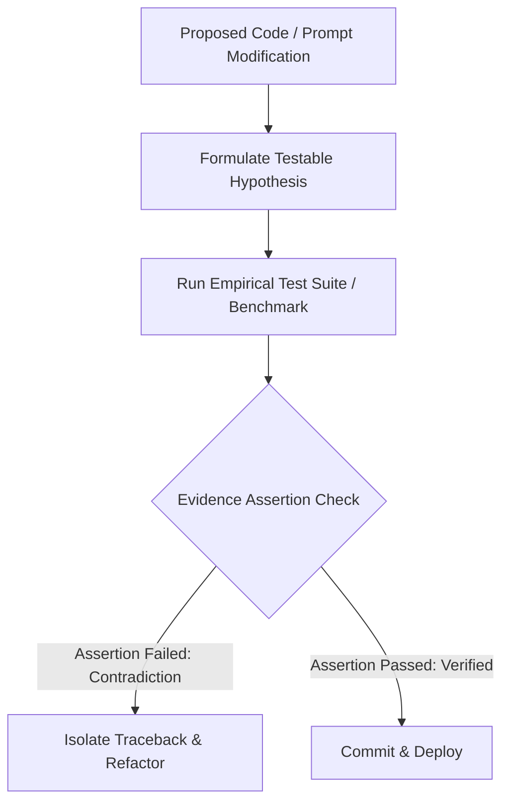

# 🔁 Verification Loop & Evidence Assertion Skill

This skill governs the evidence-based verification loop for AI agent code modifications, performance benchmarking, and realized UX invariants.

---

## 🛠️ Verification Protocol

### 1. The 4-Step Evidence Format
Never state a change works without empirical proof. Format output as:
- **Expected:** *"I expected the LLM response time to stay under 1,500ms."*
- **Tested:** *"Ran 50 automated replay trials via `node --test`."*
- **Observed:** *"System latency was 1,120ms with 0% rate limit errors."*
- **Evidence:** *"Verified log traceback at file:///path/to/test.log"*

### 2. Realized UX Invariants
- If an API or voice stream exceeds 2,000ms, the system MUST emit a transient streaming placeholder or audio filler to preserve realized user experience.
