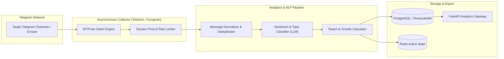

# 📈 Telegram Channel Analytics & NLP Intelligence Engine

[](https://python.org)
[](https://core.telegram.org/)
[](https://postgresql.org)
[](https://fastapi.tiangolo.com)

A high-performance analytics, message scraping, and NLP intelligence pipeline designed to monitor, index, and analyze message volume, audience growth, sentiment trends, and engagement metrics across public and private Telegram channels.

---

## 🏛️ System Architecture



---

## ✨ Key Features

- **High-Throughput Channel Scraping:** MTProto connection pooling handling historical channel archives and live message streams without triggering Telegram flood limits.
- **NLP Sentiment & Keyword Extraction:** Real-time topic modeling, sentiment polarity scoring, and engagement anomaly detection.
- **Time-Series Analytics:** Growth trajectory calculations, forward-reach estimates, and engagement-per-post analytics.
- **RESTful Analytics API:** Clean FastAPI endpoints designed to power external analytics dashboards, BI tools, and automated executive alerts.

---

## 🛠️ Tech Stack

- **Engine & Scraping:** Python 3.11, Telethon, Pyrogram, AsyncIO
- **Analytics & NLP:** Pandas, NumPy, Spacy, OpenAI API / Local embeddings
- **Backend & Database:** FastAPI, PostgreSQL / TimescaleDB, Redis, SQLAlchemy
- **Containerization:** Docker, Docker Compose

---

## ⚡ Quick Start

```bash
# Clone the repository
git clone git@github.com:yevhens-hue/telegram-analytics.git
cd telegram-analytics

# Configure credentials
cp .env.example .env
# Add your API_ID and API_HASH from my.telegram.org

# Start data ingestion pipeline
docker-compose up -d
```

---

## 👨‍💻 Author & Engineering
- **Author:** [Yevhen Shaforostov](https://github.com/yevhens-hue)
- **Role:** AI Product Manager & Full-Stack AI Engineer at [Adsy.com](https://adsy.com)


<!-- activity-sync: 2026-08-28 -->
